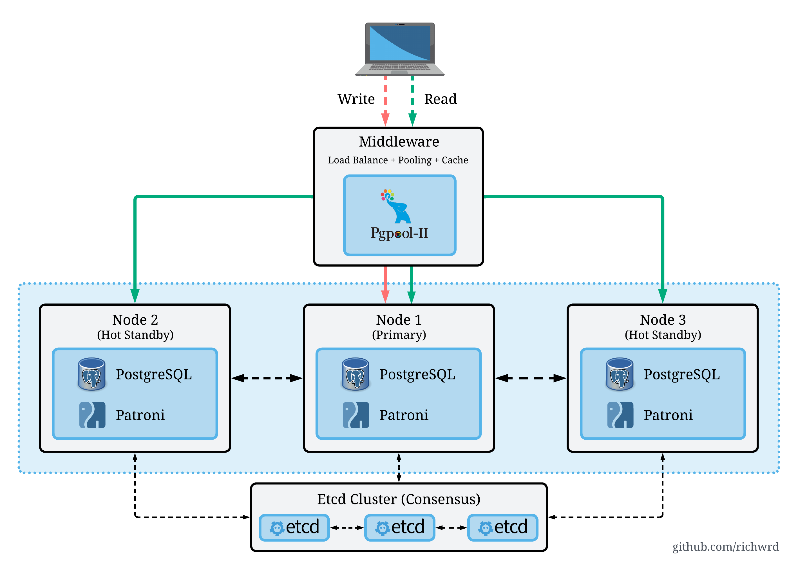

# Cluster PostgreSQL de Alta Disponibilidade com Patroni, etcd e Pgpool-II

> Projeto de Trabalho de Conclusão de Curso focado na implementação e análise de uma arquitetura de alta disponibilidade para PostgreSQL usando ferramentas open-source em um ambiente containerizado com Docker.

<p align="center">
    
</p>

## 🚀 Sobre o Projeto

Cluster PostgreSQL de alta disponibilidade desenvolvido como TCC, implementando uma arquitetura resiliente a falhas com ferramentas open-source em ambiente containerizado.

### Componentes Principais

- **PostgreSQL** (3 nós) + **Patroni**: Replicação streaming e failover automático
- **etcd** (3 nós): Coordenação distribuída e eleição de líder
- **PgPool-II**: Proxy com balanceamento de carga e roteamento inteligente
- **Prometheus Exporters**: Monitoramento de métricas

### Funcionalidades

✅ Failover automático e recuperação rápida  
✅ Balanceamento de carga para leituras  
✅ Replicação streaming assíncrona  
✅ Testes automatizados de resiliência (RTO/RPO)  
✅ Testes de performance com pgbench

## 📋 Pré-requisitos

- **Arquitetura ARM64** (projeto otimizado para ARM)
- Docker 20.10+ e Docker Compose v2.20+
- Python 3.10+ (para testes)
- Mínimo: 4 CPU cores, 8GB RAM, 20GB disco

Veja os detalhes completos em [docs/QUICK-START.md](docs/QUICK-START.md)

## 🛠️ Começando

```bash
# Clone e configure
git clone https://github.com/richwrd/postgres-ha-cluster-lab
cd postgres-ha-cluster-lab
cp .env.example .env

# Crie diretórios e suba o cluster
./scripts/create_data_dirs.sh
docker compose up -d

# Verifique a saúde
./scripts/health_checks/check_cluster_status.sh
```

**📖 Guia completo:** [docs/QUICK-START.md](docs/QUICK-START.md)

## 🧪 Testes

```bash
# Configurar ambiente
cd pytest
python3 -m venv .venv && source .venv/bin/activate
pip install -r requirements.txt

# Testes de resiliência
./scripts/test/run-crash-up.sh  # RTO
pytest tests/resilience/test_rpo_primary_failure.py -v -s  # RPO

# Testes de performance
sudo ./scripts/test/run-benchmark-baseline.sh  # Baseline
sudo ./scripts/test/run-benchmark-cluster.sh   # Cluster
```

**📖 Documentação completa:** [docs/TESTES.md](docs/TESTES.md)

## 📊 Estrutura do Projeto

```
postgres-ha-cluster-lab/
├── docker-compose*.yaml       # Configuração Docker modular
├── infra/                     # Dockerfiles e configs (Patroni, PgPool)
├── pytest/                    # Framework de testes
├── scripts/                   # Utilitários e health checks
└── docs/                      # Documentação técnica
```

## 📚 Documentação

### Guias de Uso

- **[Quick Start](docs/QUICK-START.md)**: Instalação e configuração inicial
- **[Guia de Testes](docs/TESTES.md)**: Executando testes de resiliência e performance
- **[Casos de Uso](docs/CASOS-DE-USO.md)**: Exemplos práticos e cenários reais

### Documentação Técnica

- **[Configuração Docker Compose](docs/stack/DOCKER-COMPOSE-GUIDE.md)**: Arquivos compose modulares _(em breve)_
- **[Configuração Patroni + DCS](docs/stack/CONFIGURACAO-DCS-PATRONI.md)**: etcd e Patroni _(em breve)_
- **[Autenticação PgPool](docs/stack/AUTENTICACAO-PGPOOL.md)**: Configuração de autenticação _(em breve)_
- **[Arquitetura do Projeto](docs/stack/ARQUITETURA-MODULAR.txt)**: Estrutura e design _(em breve)_

### Framework de Testes

- **[README Pytest](pytest/README.md)**: Visão geral do framework
- **[Arquitetura de Testes](pytest/ARCHITECTURE.md)**: Design e padrões

## 🎯 Casos de Uso

Exemplos práticos de uso do cluster:

- **Failover Automático**: Simule falhas e observe a recuperação
- **Benchmark de Performance**: Compare nó único vs. cluster
- **Análise de Resiliência**: Meça RTO e RPO
- **Balanceamento de Carga**: Distribua leituras entre réplicas
- **Switchover Planejado**: Troca de líder sem downtime

**📖 Guia completo com exemplos:** [docs/CASOS-DE-USO.md](docs/CASOS-DE-USO.md)

## 🔍 Monitoramento

Exporters Prometheus disponíveis:

- **PostgreSQL**: `patroni-postgres-X:9187/metrics`
- **Patroni API**: `patroni-postgres-X:8008/metrics`
- **etcd**: `etcd-X:2379/metrics`
- **PgPool**: `pgpool:9719/metrics`

_Guia completo de configuração com Prometheus e Grafana em breve._

## 🤝 Contribuindo

Contribuições são bem-vindas! Por favor:

1. Fork o projeto
2. Crie uma branch para sua feature (`git checkout -b feature/AmazingFeature`)
3. Commit suas mudanças (`git commit -m 'Add some AmazingFeature'`)
4. Push para a branch (`git push origin feature/AmazingFeature`)
5. Abra um Pull Request

## 🔗 Links Úteis

- **Documentação Oficial Patroni**: [patroni.readthedocs.io](https://patroni.readthedocs.io/en/latest/)
- **Documentação Oficial PgPool-II**: [pgpool.net](https://www.pgpool.net/docs/latest/pt/html/index.html)

---

⭐ **Se este projeto foi útil para você, considere dar uma estrela no repositório!**

---

## 📝 License

This project is licensed under the MIT License - see the [LICENSE](LICENSE) file for details.

<div align="center">

## 👤 Author

**Eduardo Richard** (richwrd)

[](https://github.com/richwrd)
[](https://www.linkedin.com/in/eduardorichard/)
[](https://www.buymeacoffee.com/richwrd)

</div>

<div align="center">

**Built with ❤️ for the PostgreSQL community**

</div>
